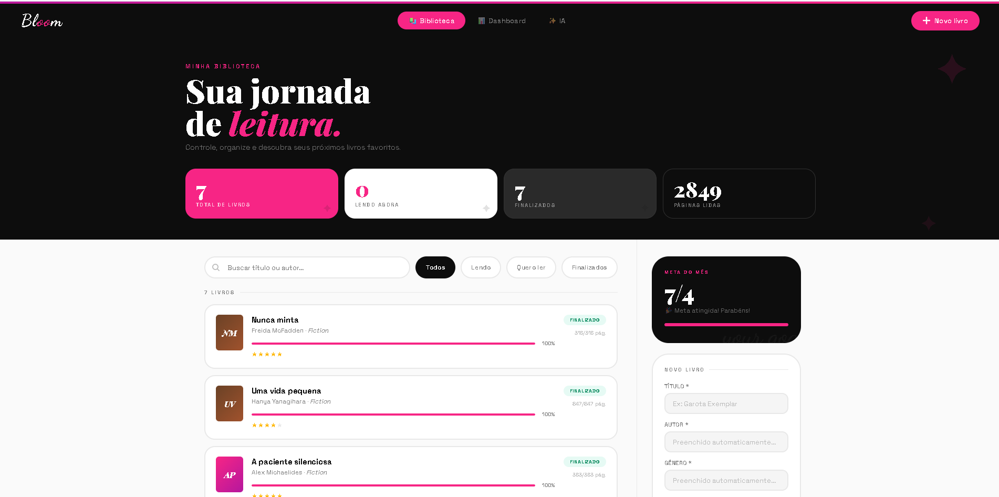
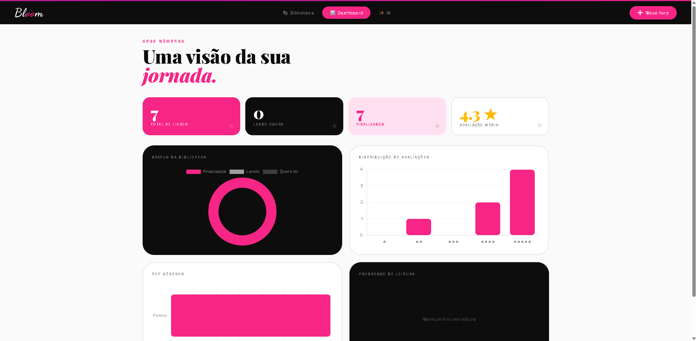
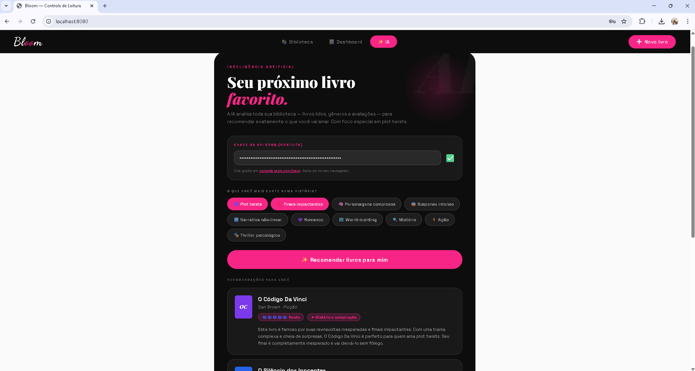

# 🌸 Bloom — Sistema de Controle de Leitura

<div align="center">


*Controle sua jornada de leitura com inteligência artificial.*

</div>

---

## ✨ Sobre o projeto

O **Bloom** é uma aplicação web completa para controle de leitura pessoal. Nasceu da minha necessidade pessoal para controlar as minhas leituras e a minha evolução como leitora, e nós leitores adoramos uma indicação, e ai me veio a ideia, porque não a AI nós indicar livros com base das nossas avaliações dos livros anteriores e os nossos gostos?
Então alem do controle estou começando a implementar a IA para este feito, por enquanto esta no inicio das recomendações da IA, mas ela já está recomendando! 

> 💡 *"Não é só uma lista de livros. É o seu perfil de leitor."*

---

## 🖥️ Funcionalidades atuais

### 📚 Biblioteca
- Cadastro completo de livros (título, autor, gênero, páginas, status, avaliação)
- **Autocomplete inteligente** via Google Books API preenche autor, gênero e número de páginas automaticamente ao digitar o título
- Busca em tempo real por título ou autor
- Filtros por status: *Todos / Lendo / Quero ler / Finalizados*
- Barra de progresso de leitura por livro
- Avaliação por estrelas (1 a 5)
- Edição e exclusão de livros via modal

### 📊 Dashboard
- Cards com total de livros, lendo agora, finalizados e páginas lidas
- Gráfico de status da biblioteca (donut)
- Distribuição de avaliações (barras)
- Ranking de gêneros mais lidos (barras horizontais)
- Progresso empilhado dos livros em leitura

### ✨ Recomendação por IA
- Chips de gostos personalizáveis (plot twists, suspense, thriller psicológico, romance, etc.)
- A IA analisa toda a biblioteca do usuário, livros lidos, gêneros e avaliações
- Retorna 3 recomendações personalizadas com nível de plot twist, elemento-chave e justificativa
- Integração com **Groq API** (gratuita) usando o modelo `llama-3.3-70b-versatile`

### 🎨 Design
- Estética bold inspirada em design editorial — rosa vibrante, preto e tipografia expressiva
- Totalmente responsivo (mobile, tablet e desktop)
- Animações e micro-interações suaves
- Peguei algumas inspirações do pinterest, para deixar com um pouco mais da minha cara.

---

## 🛠️ Tecnologias utilizadas

| Camada | Tecnologia |
|--------|-----------|
| Backend | Java 17 + Spring Boot 3 |
| Banco de dados | H2 (desenvolvimento) |
| Frontend | HTML5, CSS3, JavaScript puro |
| Gráficos | Chart.js 4 |
| Fontes | Playfair Display, Dancing Script, Space Grotesk |
| IA | Groq API — LLaMA 3.3 70B |
| Dados de livros | Google Books API |

---

## 🚀 Como rodar localmente

### Pré-requisitos
- Java 17+
- Maven

### Passos

```bash
# Clone o repositório
git clone https://github.com/seu-usuario/bloom-leitura.git
cd bloom-leitura/leitura-fixed

# Rode com Maven
./mvnw spring-boot:run
```

Acesse em: **http://localhost:8080**

### Configurar a IA (opcional)
1. Crie uma conta gratuita em [console.groq.com](https://console.groq.com)
2. Gere uma API Key em **API Keys**
3. Cole a chave na aba **✨ IA** do sistema

---

## 📁 Estrutura do projeto

```
leitura-fixed/
├── src/main/java/leituraApi/
│   ├── controller/
│   │   └── LivroController.java     # Endpoints REST
│   ├── model/
│   │   ├── Livro.java               # Entidade principal
│   │   └── StatusLeitura.java       # Enum de status
│   ├── dto/
│   │   └── DashboardDTO.java        # Dados do dashboard
│   ├── repository/
│   │   └── LivroRepository.java     # JPA Repository
│   ├── service/
│   │   └── LivroService.java        # Regras de negócio
│   └── ApiApplication.java
└── src/main/resources/
    ├── static/
    │   └── index.html               # Frontend completo
    └── application.properties
```

---

## 🔌 Endpoints da API

| Método | Rota | Descrição |
|--------|------|-----------|
| `GET` | `/api/livros` | Lista todos os livros |
| `GET` | `/api/livros/{id}` | Busca livro por ID |
| `GET` | `/api/livros/dashboard` | Dados do dashboard |
| `POST` | `/api/livros` | Cadastra novo livro |
| `PUT` | `/api/livros/{id}` | Atualiza um livro |
| `DELETE` | `/api/livros/{id}` | Remove um livro |

---

## 🗺️ Roadmap — Próximas funcionalidades

### 🤖 IA mais inteligente
> *Moldar a IA para escolhas de livros cada vez mais precisas*

- [ ] Histórico de recomendações para evitar repetições
- [ ] Feedback pós-leitura: o usuário avalia se a recomendação foi boa, e a IA aprende com isso
- [ ] Perfil de leitor dinâmico — a IA identifica padrões ao longo do tempo (ex: "você tende a amar livros com narradores não confiáveis")
- [ ] Recomendações por humor do momento ("quero algo leve hoje" vs "quero algo denso")
- [ ] Análise de ritmo de leitura — sugerir livros com tamanho compatível com o tempo disponível

### 🔗 Compartilhamento social
> *Compartilhar sua jornada de leitura com outras pessoas*

- [ ] Perfil público do leitor com sua estante virtual
- [ ] Link compartilhável da biblioteca pessoal
- [ ] Sistema de seguidores — acompanhar o que amigos estão lendo
- [ ] Reviews e resenhas públicas por livro
- [ ] Feed de leituras recentes da comunidade
- [ ] Clube do livro — grupos para leitura conjunta com chat

### 📱 Integração com redes sociais
> *Celebrar cada livro finalizado nas suas redes*

- [ ] **Gerador de Stories para Instagram** — ao finalizar um livro, gerar automaticamente um card visual estilizado (no padrão Bloom) pronto para postar nos stories
- [ ] **Card para feed** — imagem quadrada com capa do livro, avaliação em estrelas e frase favorita
- [ ] Compartilhamento direto para Twitter/X ("Acabei de terminar...")
- [ ] Integração com Goodreads para sincronizar biblioteca
- [ ] Wrapped anual — resumo visual do ano de leitura (livros lidos, páginas, gênero favorito), inspirado no Spotify Wrapped

---

## 📸 Screenshots






---

## 🤝 Contribuindo

Contribuições são bem-vindas! Sinta-se à vontade para abrir uma *issue* ou enviar um *pull request*.

1. Faça um fork do projeto
2. Crie sua branch (`git checkout -b feature/minha-feature`)
3. Commit suas mudanças (`git commit -m 'feat: adiciona minha feature'`)
4. Push para a branch (`git push origin feature/minha-feature`)
5. Abra um Pull Request

---


<div align="center">

Feito por Gabrielli Cristini 🌸 

**[⬆ Voltar ao topo](#-bloom--sistema-de-controle-de-leitura)**

</div>
